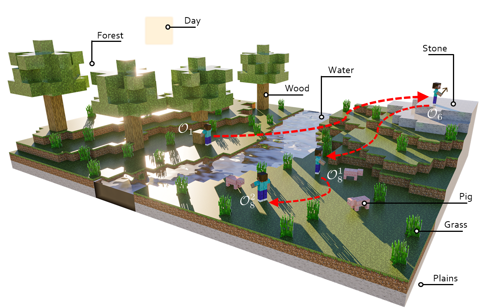
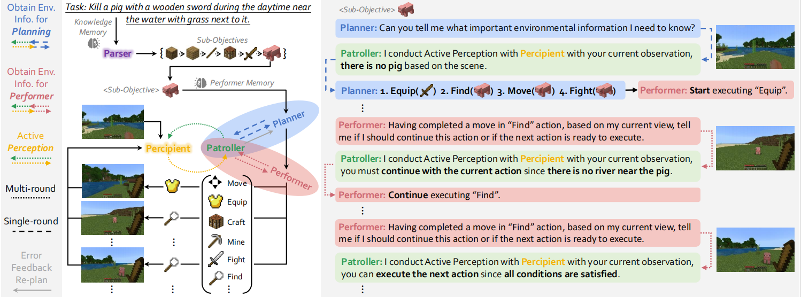
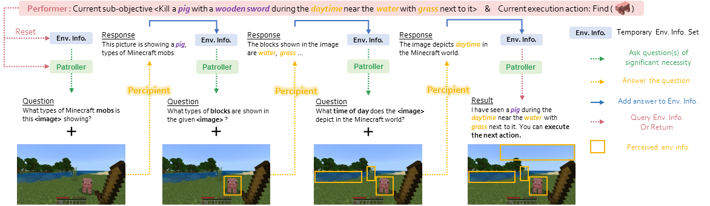

# MP5
<p align="center">  </p>
<div align="center">

## MP5: A Multi-modal Open-ended Embodied System in Minecraft via Active Perception
[[Paper](https://arxiv.org/abs/2312.07472v2)]
[[Project Page](https://iranqin.github.io/MP5.github.io/)]
[[Demo](https://www.youtube.com/watch?v=AZeS3C_S_3M)]
[[Dataset](https://huggingface.co/datasets/IranQin/MP5_dataset)]
</div>

## News

**We are currently organizing the code for MP5. If you are interested in our work, please star ⭐ our project.**

- **(2024/2/28)** MP5 is accepted to CVPR 2024!
- **(2023/12/12)** MP5 is released on [arXiv](https://arxiv.org/abs/2312.07472v2).
- **(2024/03/29)** Code is released!


## The process of finishing the task ''kill a pig with a stone sward during the daytime near the water with grass next to it.''
<p align="center">
  
</p>


### MP5 Framework
<p align="center">
  
</p>

### Active Perception
<p align="center">
  
</p>

### Directory Structure:

```
.
├── README.md
├── MP5_agnet
│   ├── All agents of MP5.
├── LAMM
│   ├── Scripts and models for training and testing MineLLM.

```


# Setup
Note: We provide all the code except the human designed interface code, which you can try to implement yourself or use [MineDreamer](https://sites.google.com/view/minedreamer/main) as a low level control module.
## Install the environment
Because MineLLM is deployed on the server side, we need two virtual environments to run MineLLM and MP5_agent.
### MineLLM
We recommend running on linux using a conda environment, with python 3.10.
You can install the environment following [here](https://openlamm.github.io/tutorial/installation#training).
```bash
# activate conda env for MineLLM
conda activete minellm

pip install -r requirement.txt
```
### MP5_agent
MineDojo requires Python ≥ 3.9. We have tested on Ubuntu 20.04 and Mac OS X. **Please follow [this guide](https://docs.minedojo.org/sections/getting_started/install.html#prerequisites)** to install the prerequisites first, such as JDK 8 for running Minecraft backend. We highly recommend creating a new [Conda virtual env](https://docs.conda.io/projects/conda/en/latest/user-guide/concepts/environments.html) to isolate dependencies. Alternatively, we have provided a [pre-built Docker image](https://docs.minedojo.org/sections/getting_started/install.html#docker-image) for easier installation.

Firstly, installing the MineDojo stable version is as simple as:

```bash
# activate conda env for MP5_agent
conda activate MP5_agent

pip install minedojo
```
or you could check [Minedojo](https://github.com/MineDojo/MineDojo/tree/main) for more details.

Then install other requirement:
```
pip install -r requirement.txt
```

## Training
 
To train MineLLM from scratch, please execute the following steps:

1. Download datasets from [web]
2. Put the datasets into `LAMM/datasets/2D_Instruct` and `cd LAMM`.
3. Train the agent by running: `. src/scripts/train_lamm2d_mc_v1.5_slurm.sh`, need to be changed if you do not use slurm.

## Running the agent
Note: We provide all the code except the human designed interface code, which you can try to implement yourself or use [MineDreamer](https://sites.google.com/view/minedreamer/main) as a low level control module.
 
### MineLLM service
To start the MineLLM service, please execute the following steps:

1. Download checkpoints from [web]
2. Put the checkpoints into `LAMM/ckpt` and `cd LAMM`.
3. Start the MineLLM service by running: `. src/scripts/mllm_api_slurm.sh`, need to be changed if you do not use slurm.

### MP5_agent
To run the MP5_agent, please execute the following steps:
```
cd MP5_agent/
bash scripts/run_agent.sh
```


### Citation	
If you find this repository useful for your work, please consider citing it as follows:
```
@article{qin2023mp5,
  title={MP5: A Multi-modal Open-ended Embodied System in Minecraft via Active Perception},
  author={Yiran Qin and Enshen Zhou and Qichang Liu and Zhenfei Yin and Lu Sheng and Ruimao Zhang and Yu Qiao and Jing Shao},
  booktitle={arXiv preprint arxiv:2312.07472},
  year={2023}
}
```
```
@article{zhou2024minedreamer,
  title={MineDreamer: Learning to Follow Instructions via Chain-of-Imagination for Simulated-World Control},
  author={Zhou, Enshen and Qin, Yiran and Yin, Zhenfei and Huang, Yuzhou and Zhang, Ruimao and Sheng, Lu and Qiao, Yu and Shao, Jing},
  journal={arXiv preprint arXiv:2403.12037},
  year={2024}
}
```